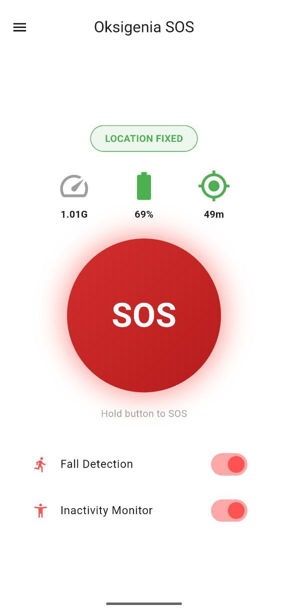
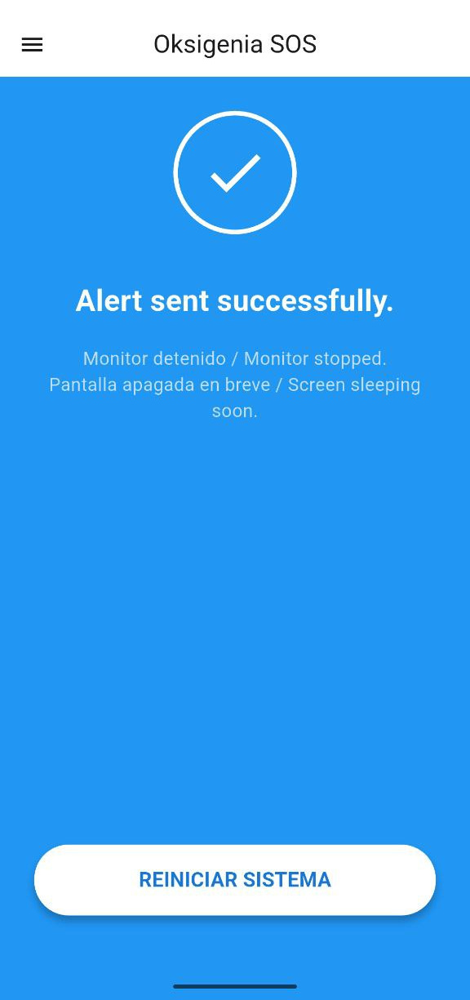

# Oksigenia SOS 🏔️ v3.6.2

**Outdoor Emergency Assistant | FOSS | Privacy-First**

[ES] Oksigenia SOS es una herramienta de seguridad personal diseñada para deportes de montaña y situaciones de riesgo. Detecta caídas o inactividad y envía SMS automáticos con coordenadas GPS. Funciona de manera autónoma, sin depender de servicios privativos.

[EN] Oksigenia SOS is a personal safety tool designed for mountain sports and risky situations. It detects falls or inactivity and sends automatic SMS with GPS coordinates. It operates autonomously without relying on proprietary services.

[](https://www.gnu.org/licenses/gpl-3.0)
[]()
[]()

👉 **[Donate via PayPal / Donar con PayPal](https://www.paypal.com/donate/?business=paypal@oksigenia.cc&currency_code=EUR)** 💙

---

## 📸 Screenshots / Capturas

| Home | Menu | Alert |
|:---:|:---:|:---:|
|  |  |  |
| **Success / Enviado** | **FOSS / Donate** | **Legal** |
|  |  |  |

---

## ✨ New in v3.6.2 / Novedades

| Feature | English | Español |
|:---|:---|:---|
| 🛡️ **Android 16 Ready** | **Immortal Service**. New foreground architecture prevents system kills on Pixel/Samsung devices (Android 14+). | **Servicio Inmortal**. Nueva arquitectura en primer plano que evita cierres del sistema en Pixel/Samsung (Android 14+). |
| 🔵 **Live Status** | New **Cyan Badge** ("MONITORING") shows when sensors are active but GPS is still acquiring. | Nuevo **Indicador Cian** ("VIGILANDO") muestra cuando los sensores funcionan pero el GPS busca señal. |
| 🌍 **Instant Lang** | Notifications now update immediately when changing app language (EN, ES, FR, PT, DE). | Las notificaciones persistentes ahora se traducen al instante al cambiar el idioma. |
| 🔒 **Signed Release** | Now signed with a dedicated **2048-bit RSA Release Key** for enhanced security. | Firmada digitalmente con **Clave RSA 2048-bit** dedicada para mayor seguridad. |

---

## ⚠️ Critical Configuration / Configuración Crítica

### 🔋 1. Battery Optimization / Optimización de Batería
[EN] To ensure sensors and GPS never "sleep", you **must** disable battery optimization:
[ES] Para asegurar que los sensores y el GPS no se "duerman", **debes** desactivar la optimización:

| Step | Action (English) | Acción (Español) |
|:---:|:---|:---|
| **1** | Long press icon > **App Info (i)** | Mantén pulsado icono > **Información (i)** |
| **2** | Go to **App battery usage** | Ve a **Uso de batería de la aplicación** |
| **3** | Select **"Unrestricted"** | Selecciona **"Sin restricciones"** |

---

### 🛡️ 2. "Restricted Settings" / Ajustes Restringidos (Android 13+)


**[ES] Español**
Si instalas el APK manualmente y ves este aviso al activar los SMS, es una medida de seguridad de Android. La app funciona correctamente, solo necesitas autorizarla:
1. Ve a **Ajustes > Apps > Oksigenia SOS**.
2. Pulsa los **tres puntos (⋮)** (esquina superior derecha).
3. Selecciona **"Permitir ajustes restringidos"**.
4. Vuelve a la app y activa el permiso de SMS.

**[🇺🇸] English**
If you sideload the APK and see a "Restricted Setting" warning when enabling SMS:
1. Go to **Settings > Apps > Oksigenia SOS**.
2. Tap the **three dots (⋮)** (top right corner).
3. Select **"Allow restricted settings"**.
4. Return to the app and grant the SMS permission.

<br clear="right"/>

---

## 🚀 Key Features / Funciones Principales

| Feature | English | Español |
|:---|:---|:---|
| 👥 **Multi-contact** | Add multiple emergency contacts. The first one receives live tracking. | Añade varios contactos de emergencia. El primero recibe el seguimiento en vivo. |
| 📍 **Live Tracking** | Sends periodic GPS updates every 30, 60, or 120 min after the SOS. | Envía actualizaciones GPS periódicas cada 30, 60 o 120 min tras el SOS. |
| ✍️ **Custom Message** | Edit the SOS text to include medical info or route details. | Edita el texto de SOS para incluir info médica o detalles de la ruta. |
| ⏱️ **Adjustable Timer** | Configurable inactivity limit: 30s (Test), 1h (Default), or 2h. | Límite de inactividad configurable: 30s (Test), 1h (Normal) o 2h. |
| 📉 **Fall Detection** | Detects severe impacts (>3.5G) using the accelerometer. | Detecta impactos severos (>3.5G) usando el acelerómetro. |
| 🔒 **Privacy** | 100% Offline. No registration, no tracking, no servers. | 100% Offline. Sin registro, sin rastreo, sin servidores. |

---

## 🛠️ Download & Build

### 📦 Download APK
Check the **[Releases Section](https://github.com/Oksigenia/oksigenia-sos/releases)** for the latest signed APKs.

### 💻 Build from source
```bash
git clone [https://github.com/Oksigenia/oksigenia-sos.git](https://github.com/Oksigenia/oksigenia-sos.git)
cd oksigenia-sos
flutter pub get
flutter build apk --release --split-per-abi
